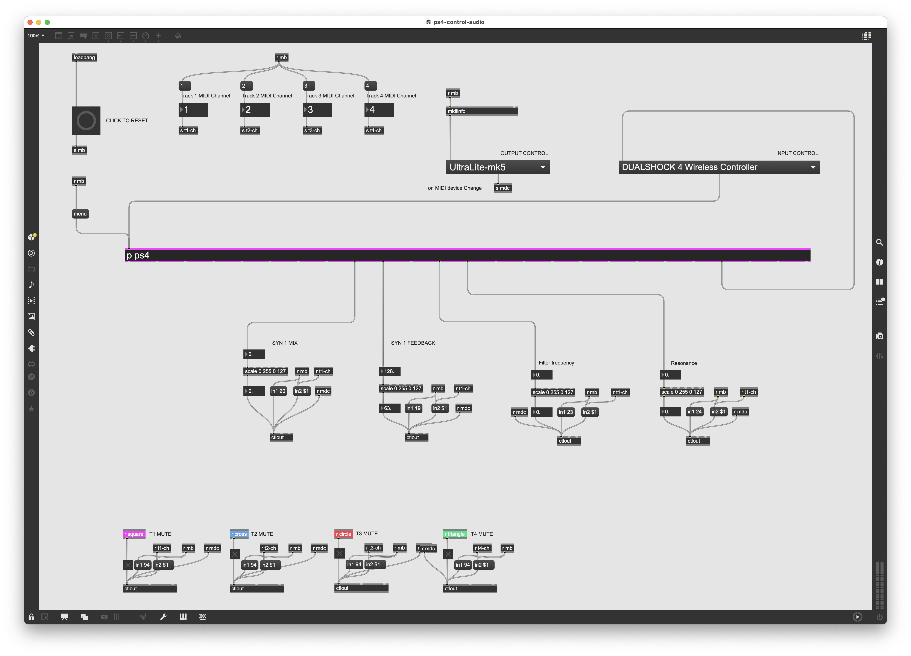

# Max Patch for PS4 Controller Audio Manipulation

This Max patch utilizes a PS4 controller to manipulate audio signals. The controller's outputs are routed to a `hi` object, which handles human interface devices.

## Patch Overview

### Key Components:
- **PS4 Controller**: Connected through USB and managed via the `hi` object.
- **route Object**: Receives controller signals (like button presses and joystick movements) and directs them to appropriate destinations.
- **Audio Interface**: Outputs the manipulated audio signals based on controller input.

The signals from the PS4 controller are processed in real-time, allowing dynamic audio manipulation during performances or recordings.
